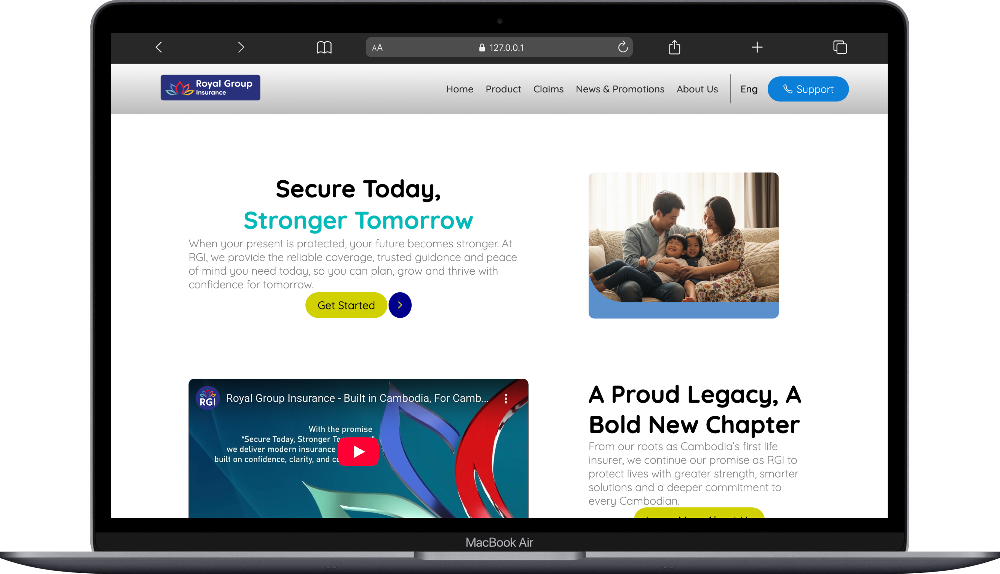
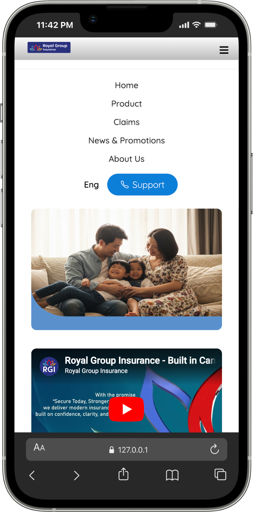

# RGI Insurance Website - Yoeurn Kimsan

A responsive website for Royal Group Micro Insurance built with HTML and CSS.

**Live Demo:** https://sliptfrogs.github.io/Royal-group-micro-insurance-clone/

## Screenshots

**Desktop Version:**

**Mobile Version:**

## Features I Built

Here's what I implemented in this project:

- Responsive navigation bar with hamburger menu for mobile devices
- Hero section with image and video content
- Product showcase section featuring 3 insurance products
- News and promotions cards with images and descriptions
- Contact information section with company details
- Footer with links and social media icons
- Mobile-first responsive design (works on phones, tablets, and desktops)
- Language switcher dropdown

The site works well on different screen sizes - I tested it on mobile (320px), tablet (768px), and desktop screens.

## Credits

**Images:** All images and logos are from the official RGI website ([rgi.com.kh](https://www.rgi.com.kh/en/landing))

**Fonts:**
- Quicksand from Google Fonts
- Ubuntu Condensed from Google Fonts

**Icons:** Ionicons library for all the icons (navigation, social media, buttons)

**Video:** Embedded YouTube video from RGI's official channel

## Running the Project

You can run this project locally in a few ways:

**Easy way:**
1. Download or clone this via repo (https://github.com/sliptfrogs/Royal-group-micro-insurance-clone.git)
2. Just double-click the `index.html` file
3. It should open in your browser

**If you use VS Code:**
1. Install the "Live Server" extension
2. Right-click on `index.html`
3. Click "Open with Live Server"

